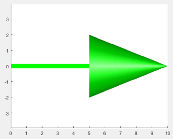

# arrow3D
A 3D arrow in matlab.

arrow3D is a ...3D arrow with a "solid" head. It is a graphical object composed by a line and a 3D surface, which represents the arrow head.
arrow3D is defined by a starting poing P0 and a final point P1. It looks different from quiver3D, which has a flat aspect, and arrow3D's head can be customized.
The thickness of the line and the size of the head can be specified, as well as its colour.

## Usage 

```matlab

    figure
    h = arrow3D([0, 10], [0, 0], [0, 0]);
    h.LineWidth = 10;
    h.ArrowHeadLength = 5;
    h.Color = 'g';
    lighting gouraud;  light;  axis equal;

```


*An example of a 3D arrow* 


## License

MIT License

Copyright (c) [2022] [Claudio Vergari]

Permission is hereby granted, free of charge, to any person obtaining a copy
of this software and associated documentation files (the "Software"), to deal
in the Software without restriction, including without limitation the rights
to use, copy, modify, merge, publish, distribute, sublicense, and/or sell
copies of the Software, and to permit persons to whom the Software is
furnished to do so, subject to the following conditions:

The above copyright notice and this permission notice shall be included in all
copies or substantial portions of the Software.

THE SOFTWARE IS PROVIDED "AS IS", WITHOUT WARRANTY OF ANY KIND, EXPRESS OR
IMPLIED, INCLUDING BUT NOT LIMITED TO THE WARRANTIES OF MERCHANTABILITY,
FITNESS FOR A PARTICULAR PURPOSE AND NONINFRINGEMENT. IN NO EVENT SHALL THE
AUTHORS OR COPYRIGHT HOLDERS BE LIABLE FOR ANY CLAIM, DAMAGES OR OTHER
LIABILITY, WHETHER IN AN ACTION OF CONTRACT, TORT OR OTHERWISE, ARISING FROM,
OUT OF OR IN CONNECTION WITH THE SOFTWARE OR THE USE OR OTHER DEALINGS IN THE
SOFTWARE.

[MIT](https://choosealicense.com/licenses/mit/)
